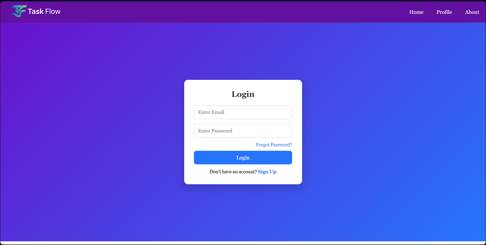
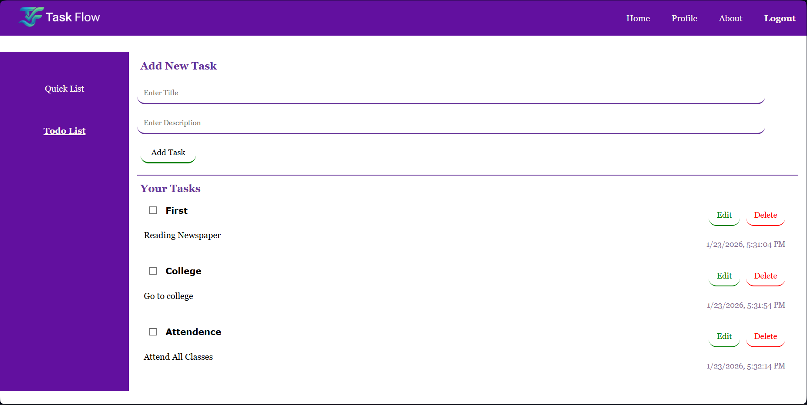
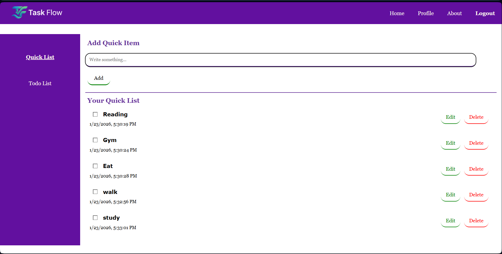

# Task Flow

<div align="center">


**A modern, cloud-synced task management application**

[](https://reactjs.org/)
[](https://firebase.google.com/)
[](https://vitejs.dev/)
[](LICENSE)

[Live Demo](https://taskflow-olive-seven.vercel.app/)

</div>

---

## 📋 Table of Contents

- [Overview](#overview)
- [Features](#features)
- [Tech Stack](#tech-stack)
- [Screenshots](#screenshots)
- [Getting Started](#getting-started)
  - [Prerequisites](#prerequisites)
  - [Installation](#installation)
  - [Firebase Configuration](#firebase-configuration)
- [Project Structure](#project-structure)
- [Usage](#usage)
- [Security](#security)
- [Contributing](#contributing)
- [License](#license)
- [Contact](#contact)
- [Acknowledgments](#acknowledgments)

---

## 🎯 Overview

Task Flow is a feature-rich task management application that combines the power of React with Firebase's real-time capabilities. Built with modern web technologies, it provides users with a seamless experience for organizing tasks, creating quick notes, and managing their productivity across devices.

The application features a clean, intuitive interface with robust authentication and real-time data synchronization, ensuring your tasks are always accessible and up-to-date.

---

## ✨ Features

### Core Functionality
- **🔐 Secure Authentication** - Complete user authentication system with signup, login, and logout capabilities
- **📝 Todo Management** - Create, edit, delete, and mark tasks as complete with real-time updates
- **⚡ Quick Lists** - Capture instant notes and ideas without the overhead of full task creation
- **👤 User Profiles** - Personalized user profile pages with account management

### Technical Highlights
- **☁️ Cloud Synchronization** - Automatic data sync across all devices using Firebase Realtime Database
- **🛡️ Protected Routes** - Role-based access control ensuring data privacy
- **📱 Responsive Design** - Fully optimized for mobile, tablet, and desktop viewing
- **⚡ Fast Performance** - Built with Vite for lightning-fast development and optimized production builds
- **🎨 Modern UI/UX** - Clean, intuitive interface with smooth animations and transitions

---

## 🛠 Tech Stack

| Category | Technology |
|----------|-----------|
| **Frontend** | React 18.x, React Router v6 |
| **Build Tool** | Vite 5.x |
| **Backend** | Firebase Authentication, Firebase Realtime Database |
| **State Management** | React Context API |
| **Styling** | CSS3, Flexbox, CSS Grid |
| **Deployment** | GitHub Pages |

---

## 📸 Screenshots

<div align="center">

### Login Page


### Todo List


### Quick List


### About Section


</div>

---

## 🚀 Getting Started

### Prerequisites

Before you begin, ensure you have the following installed:
- **Node.js** (version 16.x or higher)
- **npm** (version 8.x or higher) or **yarn**
- A **Firebase account** (free tier is sufficient)

### Installation

1. **Clone the repository**
   ```bash
   git clone https://github.com/your-username/taskflow.git
   cd taskflow
   ```

2. **Install dependencies**
   ```bash
   npm install
   ```

### Firebase Configuration

1. **Create a Firebase project**
   - Navigate to [Firebase Console](https://console.firebase.google.com)
   - Click "Add Project" and follow the setup wizard
   - Register your web app to get configuration credentials

2. **Enable required services**
   - **Authentication**: Enable Email/Password sign-in method
   - **Realtime Database**: Create a database and set initial rules

3. **Configure environment variables**
   
   Create a `src/Firebase.js` file with your Firebase credentials:
   
   ```javascript
   import { initializeApp } from "firebase/app";
   import { getAuth } from "firebase/auth";
   import { getDatabase } from "firebase/database";

   const firebaseConfig = {
     apiKey: "YOUR_API_KEY",
     authDomain: "YOUR_AUTH_DOMAIN",
     databaseURL: "YOUR_DATABASE_URL",
     projectId: "YOUR_PROJECT_ID",
     storageBucket: "YOUR_STORAGE_BUCKET",
     messagingSenderId: "YOUR_SENDER_ID",
     appId: "YOUR_APP_ID"
   };

   export const app = initializeApp(firebaseConfig);
   export const auth = getAuth(app);
   export const database = getDatabase(app);
   ```

4. **Start the development server**
   ```bash
   npm run dev
   ```

5. **Open your browser**
   
   Navigate to `http://localhost:5173` to view the application

---

## 📁 Project Structure

```
taskflow/
├── public/
│   └── vite.svg
├── src/
│   ├── assets/
│   │   └── img/
│   ├── components/
│   │   ├── Auth/
│   │   ├── TodoList/
│   │   ├── QuickList/
│   │   └── Profile/
│   ├── context/
│   │   └── AuthContext.jsx
│   ├── App.jsx
│   ├── main.jsx
│   └── Firebase.js
├── .gitignore
├── index.html
├── package.json
├── vite.config.js
└── README.md
```

---

## 💻 Usage

1. **Sign Up / Login**
   - Create a new account or login with existing credentials
   - All data is securely stored per user account

2. **Manage Tasks**
   - Add new tasks using the input field
   - Mark tasks as complete by clicking the checkbox
   - Edit or delete tasks using the action buttons

3. **Quick Lists**
   - Access the Quick List for rapid note-taking
   - Perfect for capturing fleeting thoughts and ideas

4. **Profile Management**
   - View and update your profile information
   - Manage account settings and preferences

---

## 🔒 Security

Task Flow implements multiple security layers:

- **User Authentication** - Firebase Authentication handles secure user sessions
- **Data Isolation** - Each user's data is stored separately using their unique Firebase Auth UID
- **Protected Routes** - Unauthenticated users cannot access application features
- **Database Rules** - Firebase security rules ensure users can only access their own data

**Example Firebase Database Rules:**
```json
{
  "rules": {
    "users": {
      "$uid": {
        ".read": "$uid === auth.uid",
        ".write": "$uid === auth.uid"
      }
    }
  }
}
```

---

## 🤝 Contributing

Contributions are what make the open-source community such an amazing place to learn, inspire, and create. Any contributions you make are **greatly appreciated**.

1. Fork the Project
2. Create your Feature Branch (`git checkout -b feature/AmazingFeature`)
3. Commit your Changes (`git commit -m 'Add some AmazingFeature'`)
4. Push to the Branch (`git push origin feature/AmazingFeature`)
5. Open a Pull Request

---

## 📄 License

Distributed under the MIT License. See `LICENSE` file for more information.

---

## 👤 Contact

**Neeraj**

- GitHub: [@DeceptiveNeeraj](https://github.com/DeceptiveNeeraj)
- Project Link: [https://github.com/your-username/taskflow](https://github.com/your-username/taskflow)

---

## 🙏 Acknowledgments

- [React Documentation](https://reactjs.org/)
- [Firebase Documentation](https://firebase.google.com/docs)
- [Vite Documentation](https://vitejs.dev/)
- [Shields.io](https://shields.io/) for README badges

---

<div align="center">

**If you found this project helpful, please consider giving it a ⭐!**

Made with ❤️ by Neeraj

</div>